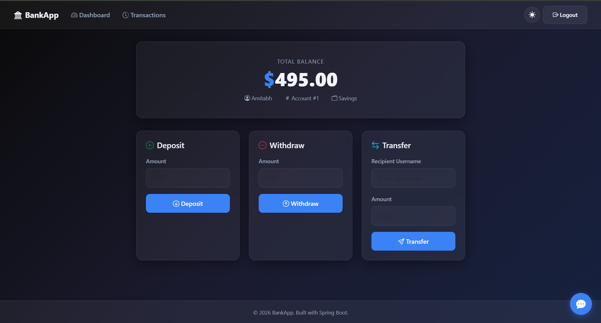
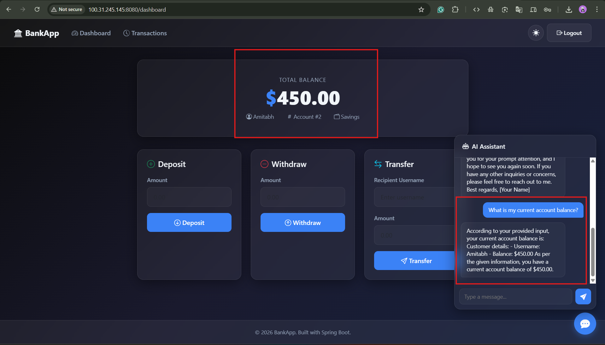
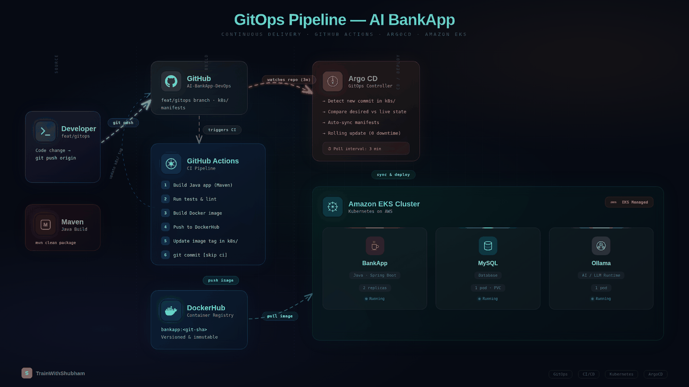

<div align="center">

# AI BankApp

### End-to-End GitOps on Amazon EKS

A modern banking application with an integrated AI chatbot, deployed on AWS EKS using Terraform, Argo CD, the AWS Load Balancer Controller, and Prometheus monitoring.

[](https://www.oracle.com/java/technologies/javase/jdk21-archive-downloads.html)
[](https://spring.io/projects/spring-boot)
[](https://aws.amazon.com/eks/)
[](https://argo-cd.readthedocs.io/)
[](https://www.terraform.io/)
[](https://hub.docker.com/)

---





</div>

---

## Features

- **Banking Operations** — Deposit, withdraw, transfer funds between accounts
- **AI Chatbot** — Context-aware financial assistant powered by Ollama (TinyLlama), self-hosted on Kubernetes
- **Dark/Light Mode** — Glassmorphism UI with theme toggle and localStorage persistence
- **Spring Security** — BCrypt password hashing, CSRF protection, form-based authentication
- **Prometheus Metrics** — Internal management endpoint scraped through a `ServiceMonitor`

---

## Architecture

<div align="center">



</div>

| Layer | Tool |
|-------|------|
| **Infrastructure** | Terraform (VPC + EKS + ArgoCD) |
| **CI Pipeline** | GitHub Actions → Amazon ECR |
| **GitOps / CD** | ArgoCD (auto-sync from `k8s/` manifests) |
| **Ingress** | AWS Load Balancer Controller (ALB, IP targets) |
| **TLS** | AWS Certificate Manager with HTTP-to-HTTPS redirect |
| **Monitoring** | kube-prometheus-stack (Prometheus + Grafana) |
| **AI Chatbot** | Ollama (TinyLlama) on EKS |
| **Storage** | EBS CSI Driver (gp3 dynamic provisioning) |

---

## What Gets Deployed

| Resource | Details |
|----------|---------|
| **EKS Cluster** | Kubernetes 1.35 with separate system and application node groups |
| **BankApp** | 2 replicas with HPA (scales to 4), rolling updates |
| **MySQL 8.0** | Persistent EBS volume (gp3) |
| **Ollama AI** | TinyLlama model with persistent storage |
| **Ingress** | Internet-facing ALB with ACM TLS and HTTP-to-HTTPS redirects |
| **Monitoring** | Prometheus + Grafana dashboards |
| **ArgoCD** | Auto-sync, self-heal, prune |

---

## Quick Start

> Full step-by-step commands with troubleshooting: [`DEPLOYMENT.md`](DEPLOYMENT.md)

```bash
# 1. Provision an environment (~20 min)
cd terraform/live/dev
terraform init
terraform plan -out=tfplan
terraform apply tfplan

# 2. Configure kubectl
aws eks update-kubeconfig --name ai-bankapp-dev --region ap-south-1

# 3. Request/validate the ACM certificate named in k8s/ingress.yml
#    and point its DNS name to the ALB after the first Argo CD sync

# 4. Deploy via ArgoCD
kubectl apply -f argocd/application.yml

# 5. Pull AI model
kubectl exec -n bankapp deploy/ollama -- ollama pull tinyllama
```

---

## CI/CD — GitOps Flow

```
Dev code push → GitHub Actions → Build and push to ECR → Update k8s manifest → Argo CD auto-sync → EKS
```

1. Push application changes to `dev`.
2. **GitHub Actions** tests the app and assumes the repository-scoped AWS role through OIDC.
3. The workflow pushes the image to `ai-bankapp-dev` in ECR with the commit SHA tag.
4. The workflow updates `k8s/bankapp-deployment.yml` and commits the new tag to `dev`.
5. **Argo CD** detects the manifest commit and performs the rolling update in EKS.

The ECR role is provisioned by Terraform. No long-lived AWS access keys or
Docker Hub credentials are required for the dev deployment workflow.

---

## Project Structure

```
.
├── terraform/              # Infrastructure as Code (VPC + EKS + ArgoCD)
├── k8s/                    # Kubernetes manifests (ArgoCD watches this)
│   ├── bankapp-deployment.yml
│   ├── mysql-deployment.yml
│   ├── ollama-deployment.yml
│   ├── service.yml
│   ├── ingress.yml         # AWS ALB + ACM HTTPS redirect
│   ├── hpa.yml             # Horizontal Pod Autoscaler
│   └── ...                 # namespace, configmap, secrets, pv, pvc
├── argocd/
│   └── application.yml     # ArgoCD Application
├── .github/workflows/
│   └── gitops-ci.yml       # Dev CI → ECR → manifest update
└── DEPLOYMENT.md           # Step-by-step deployment playbook
```

---

## Documentation

| Document | Purpose |
|----------|---------|
| [`DEPLOYMENT.md`](DEPLOYMENT.md) | Step-by-step deployment commands + gotchas |
| [`terraform/README.md`](terraform/README.md) | Detailed infrastructure setup + troubleshooting |
| [`PRODUCTION.md`](PRODUCTION.md) | Production configuration, secret handling, and go-live checks |

---

## Tech Stack

**Backend:** Java 21, Spring Boot 3.4.13, Spring Security, Thymeleaf, Flyway, JDBC Session, Actuator

**Frontend:** Bootstrap 5, glassmorphism dark/light UI, CSS custom properties

**AI:** Ollama with TinyLlama — self-hosted, zero cost, runs as a Kubernetes pod

**Database:** MySQL 8.0 with EBS gp3 persistent volumes

**DevOps:** Terraform, GitHub Actions, Argo CD, AWS Load Balancer Controller, ACM, kube-prometheus-stack

---

<div align="center">

**TrainWithShubham** — Happy Learning

</div>
